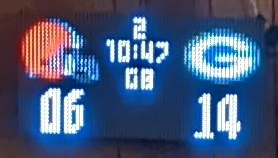
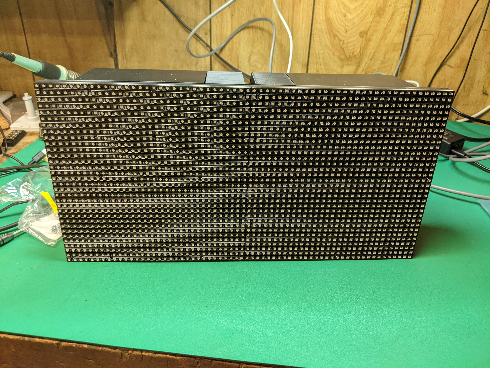
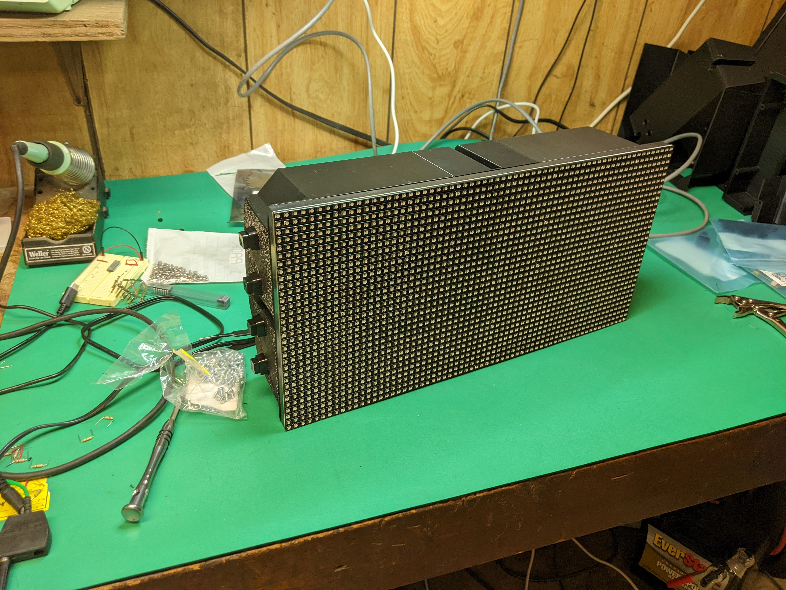
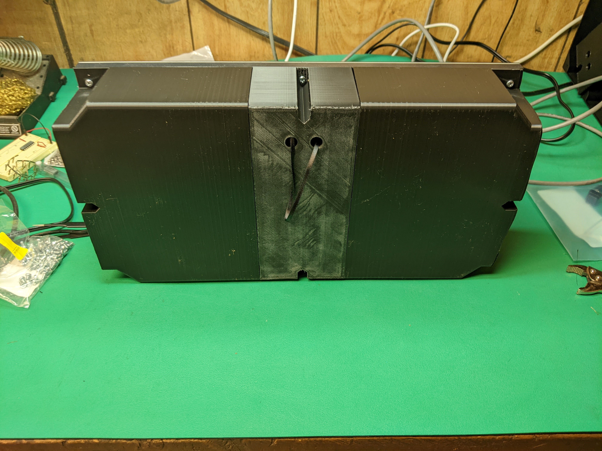
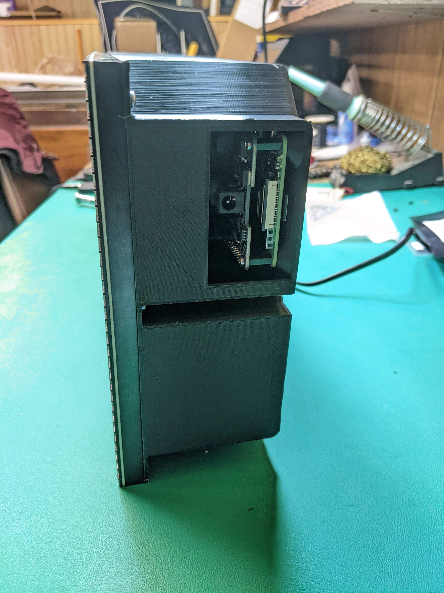

# Multi-Sport LED display

## Credits
A huge thanks to the following:
* ESPN.com for making an openly accessible sports data API that enables all these projects
* Github user mikemountain for NFL support and my original inspiration: https://github.com/mikemountain/nfl-led-scoreboard
* Github user riffnshred on whose work mikemountain's was based: https://github.com/riffnshred/nhl-led-scoreboard
* Github developers who wrote the MLB LED scoreboard on which all the above are based: https://github.com/MLB-LED-Scoreboard/mlb-led-scoreboard
* Github user hzeller for the RGB matrix driver: https://github.com/hzeller/rpi-rgb-led-matrix/

