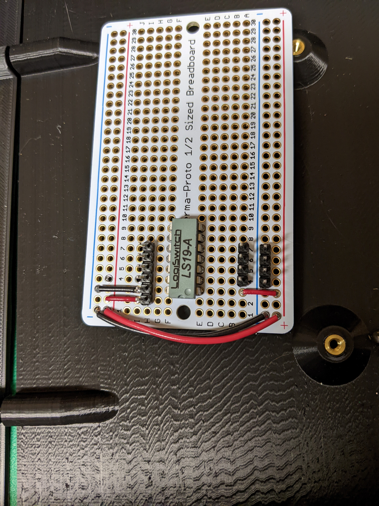
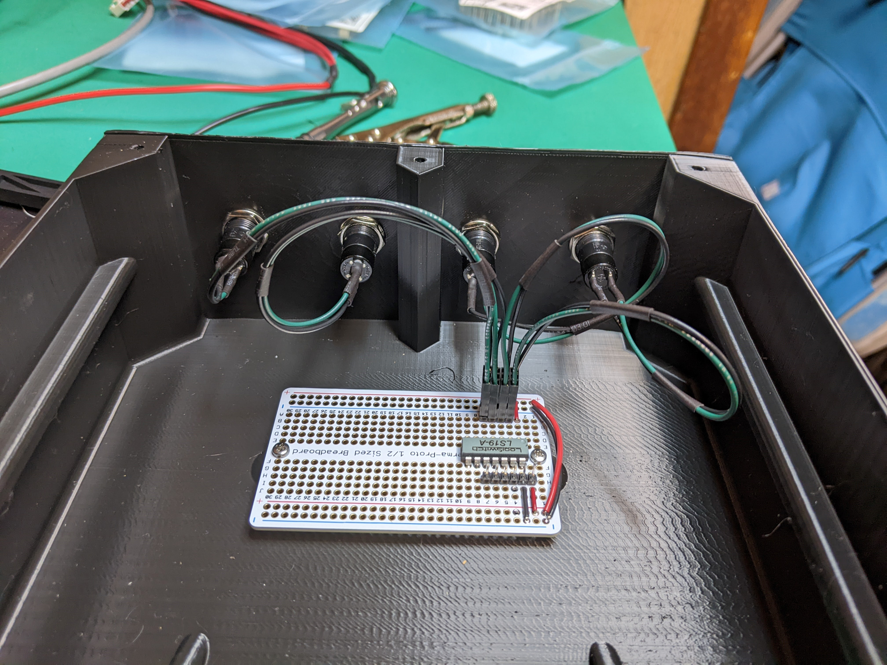
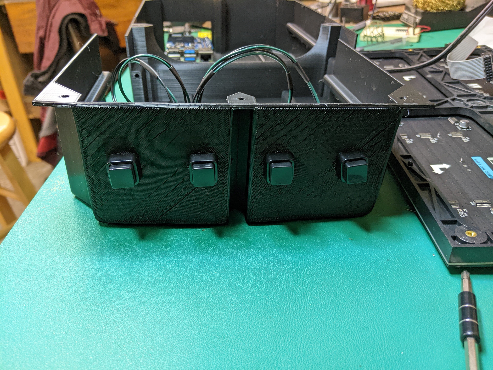
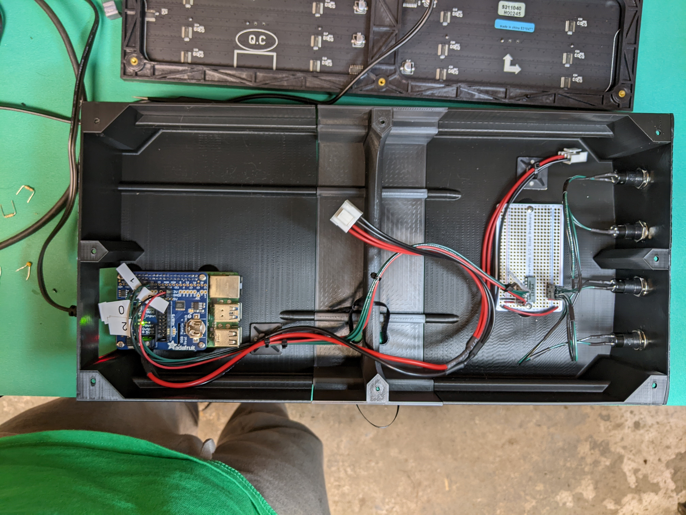
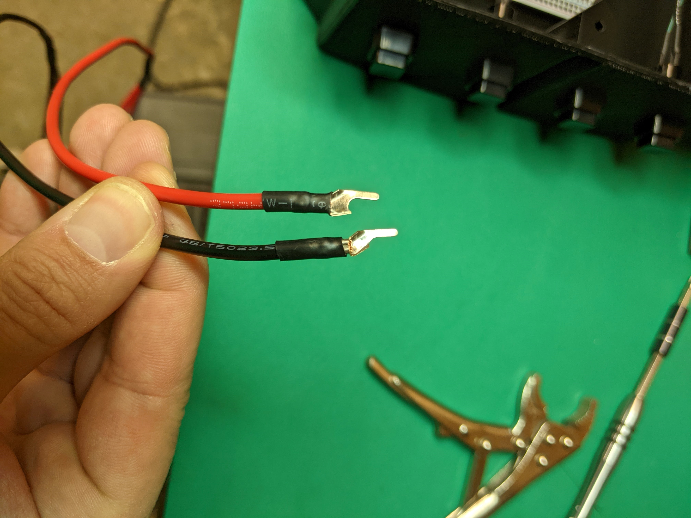
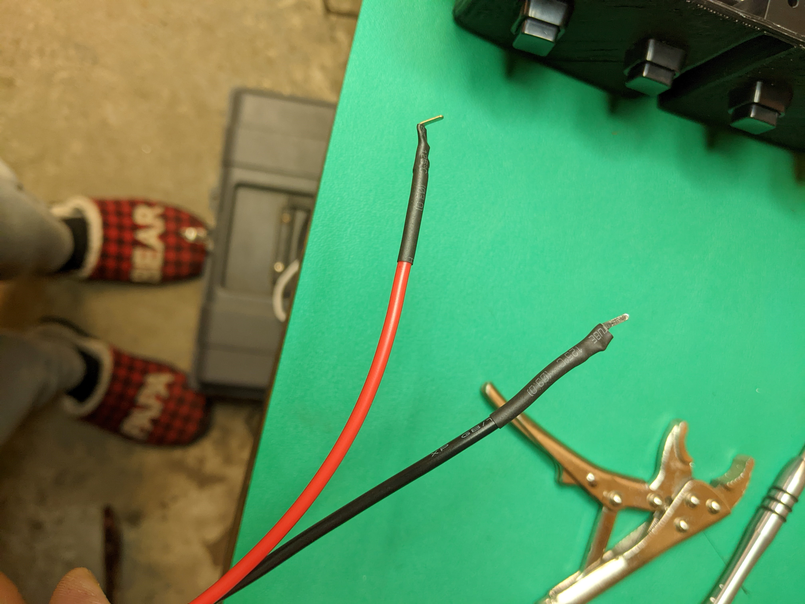

# Soldering and wiring

## Pi hat

1. Solder a short wire between GPIO pins 4 and 18 (Directions from here: https://github.com/hzeller/rpi-rgb-led-matrix/tree/6668ff8b55fcfe5ea36cf22aa48155c9ced177a9#improving-flicker)
1. Solder a male header pin onto each of these GPIO pins for the buttons: [14,15,25,19]
1. Solder a male header pin onto a 3.3V pin and to a GND pin

Should look like this when done:

## Adafruit perma proto board

1. Solder debounce chip as shown in the image below.  Inputs go to a header on one side, outputs and power in on the other.

## Buttons

Note: I used green for signal wires.  Use whatever color you want; I'm not your boss.

1. Cut a green and black wire for each button - about 5" long each.
1. Solder one of each color wire to each button, and cover terminals with heatshrink.
1. Crimp a rectangular header socket contact to each wire, and slide into pins 1 and 3 of a 3-position housing.  This will allow the buttons to connect between the ground and signal headers on the proto board.

## Debouncer-to-Pi-hat cable

1. This cable is about 2 feet long to allow it to be secured to the backshell. It's 4 signal conductors, one ground, one 3.3V.  So 1 red, 1 black, and 4 green.
1. Crimp a rectangular header socket contact to each end of each wire
1. On one end, use either a 6 position housing or qty2 3position housings.  See image of proto board.
1. The other end has to go to a bunch of different places on the pi hat.  I just wrapped each contact in heatshrink.

## LED panel power cable

The kit from Adafruit for me came with a cable with spade connectors.  I don't like to have that much exposed energized conductor surface.  So I cut off half of each spade, removed the old heatshrink, and added new heatshrink that went further along the spade.  I also bent each spade.  You could also buy ferrules and re-crimp.

