# Printing and assembly

## Printing

The backshell prints in three parts: left, right, and center.  These are from the viewer's perspective - "left" has the button holes, "right" has the Pi.  STL files for all three are found in this directory.

Print settings I used common to all three parts:
* PLA
* 0.4mm nozzle
* 1.05mm wall thickness (maybe do thicker - it's important for the threaded inserts to grab onto something)
* 40% infill, gyroid (made this higher than default to strengthen the parts)
* 6 top layers, 6 bottom layers
* Brim adhesion
* Coasting off
* 200°C extruder
* 60°C bed
* 15mm/s initial speed
* 50mm/s final speed

Print the left and right sides with no supports, and their alignment pins facing upward.  You won't be able to remove supports from the holes for the threaded inserts, so definitely do not use supports.

The screenshot below shows both the left and right sides together as one print.  I don't recommend this, as it adds about a day to the overall printing.

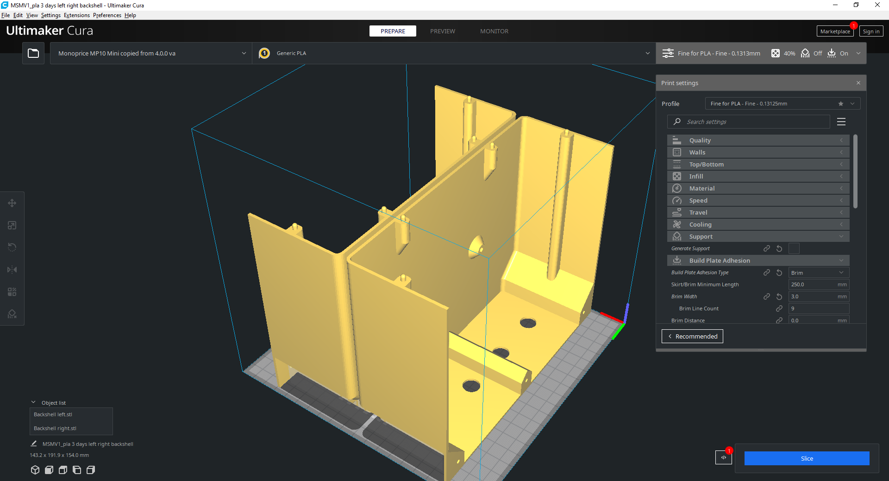

1. Print the center side with supports on and the large rib upward (the "inside" up).

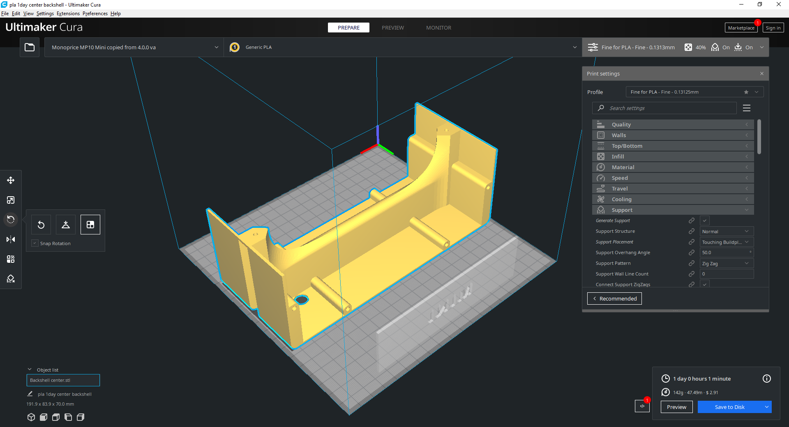

Each of the parts is about a 1 day print.

## Assembly

Install the threaded inserts by setting your soldering iron to about 400°F and gently melting them down in.  You need 4 for the pi and 2 for the perma proto board.

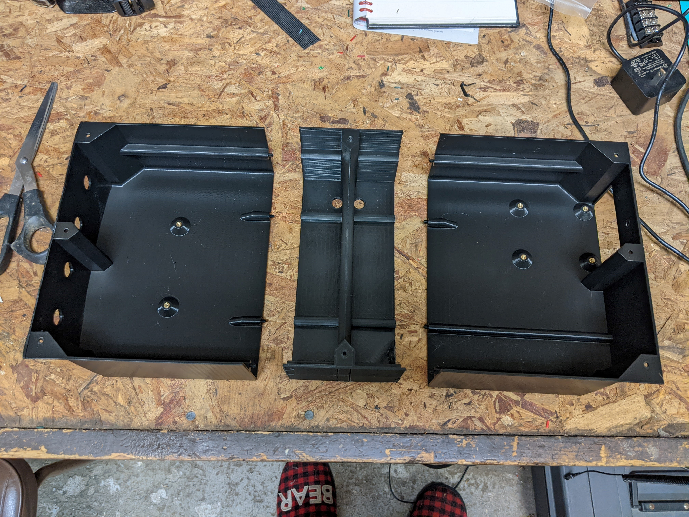

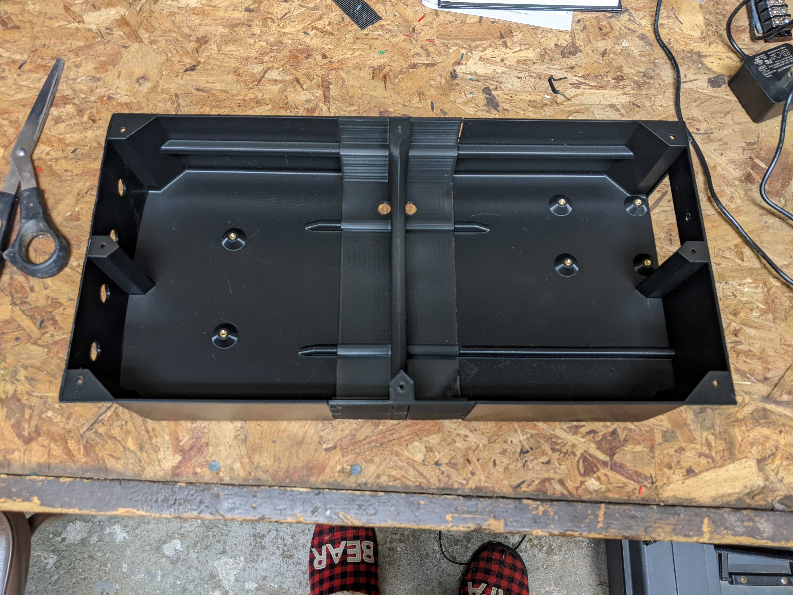

If you want to hang the display on the wall, tie about a 6" length of ribbon (or string, or wire) through the holes in the center piece.

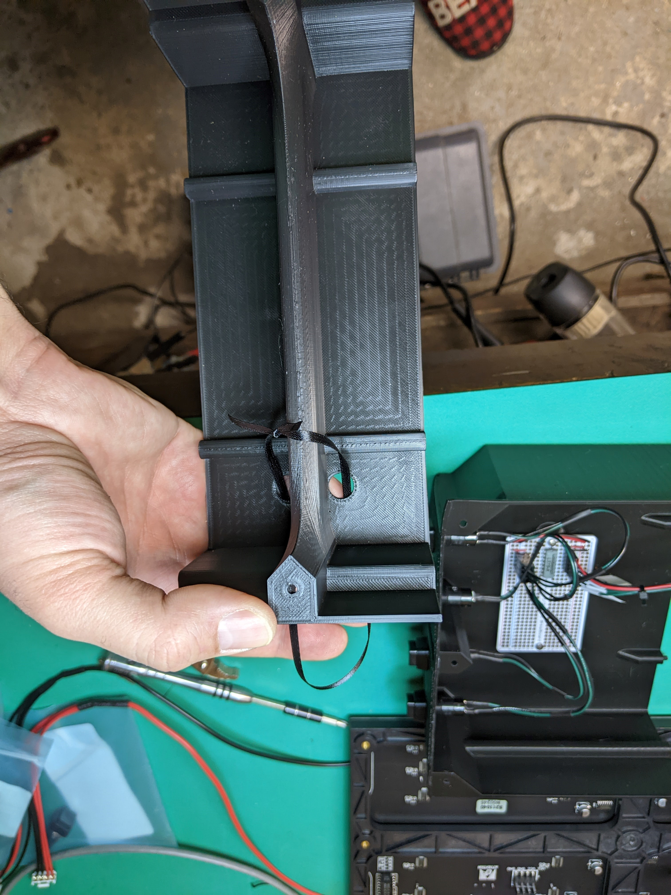

Perform all soldering (see electrical notes) prior to assembly.

Place Pi, screw down with 4 standoffs

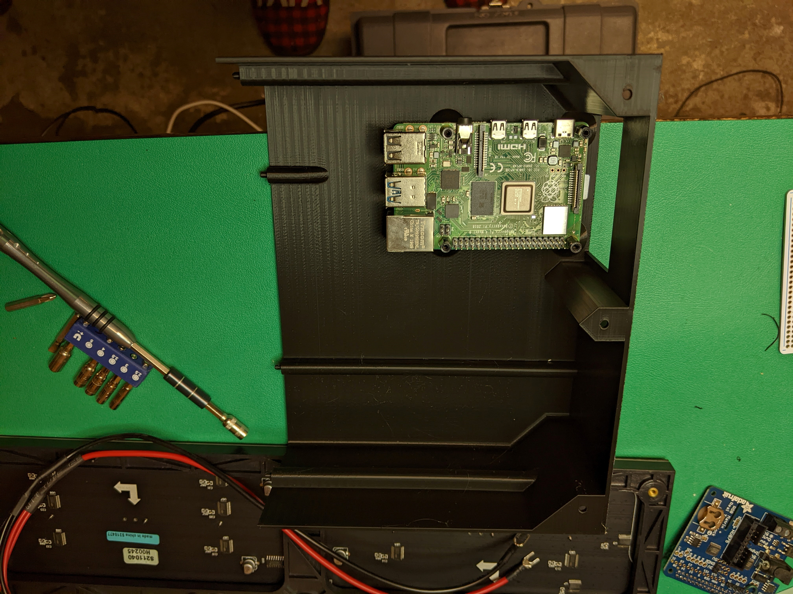

Place Pi Hat, screw down with 4 M2.5 screws. Install coin cell battery. (Note this photo shows some header pins in the wrong place)

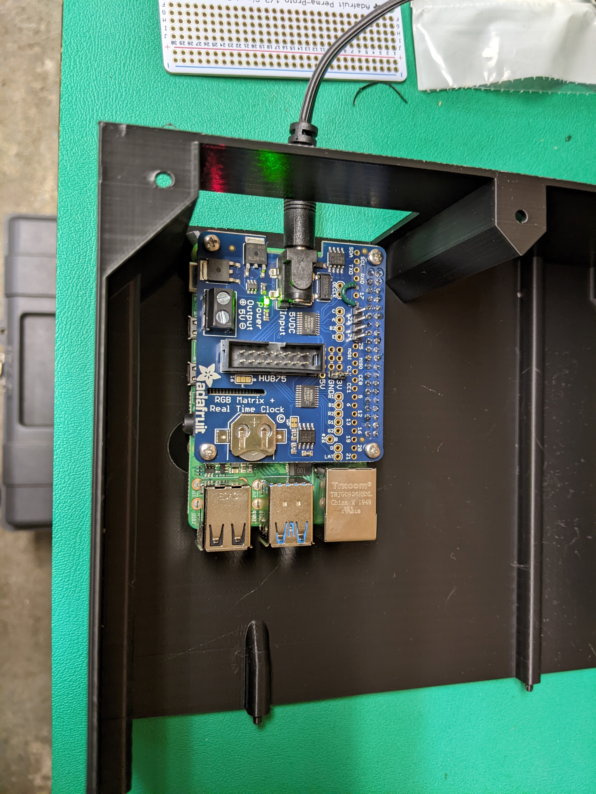

Install perma proto board.  Install buttons and connect them.

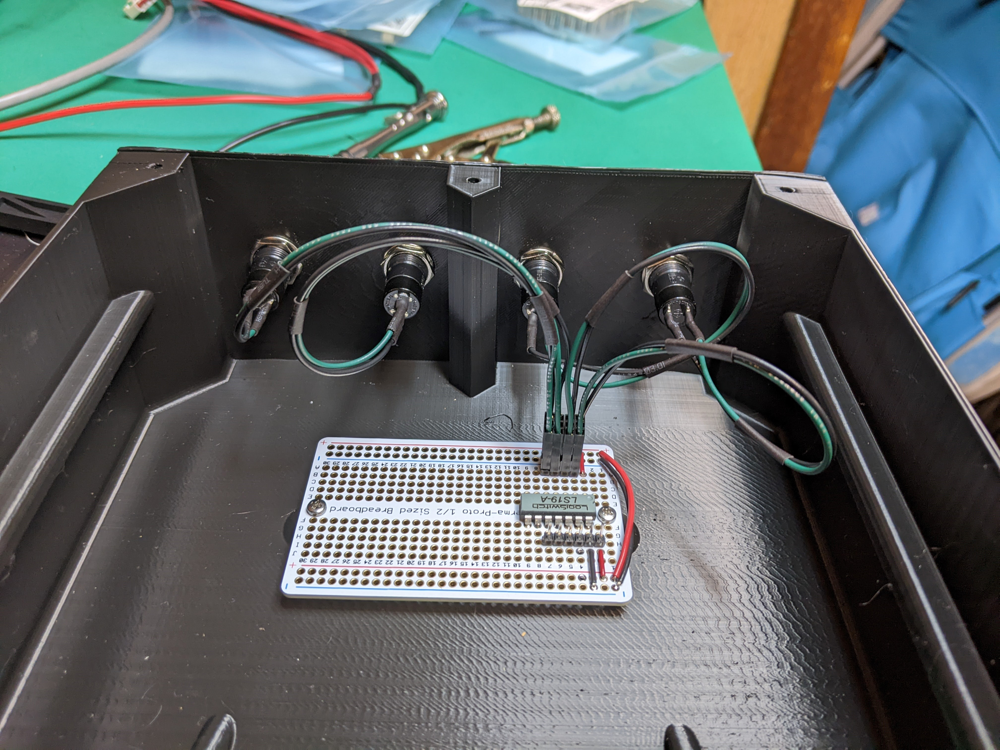

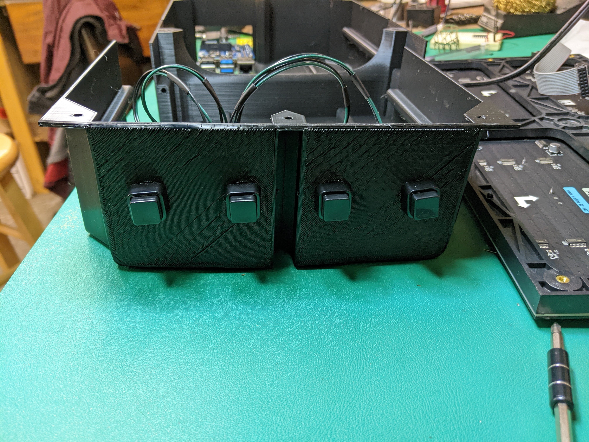

Connect all wiring (you'll need to have the backshell close to the LED panel to do this.  Use a wire anchor and zipties to keep wires from rattling around too much.

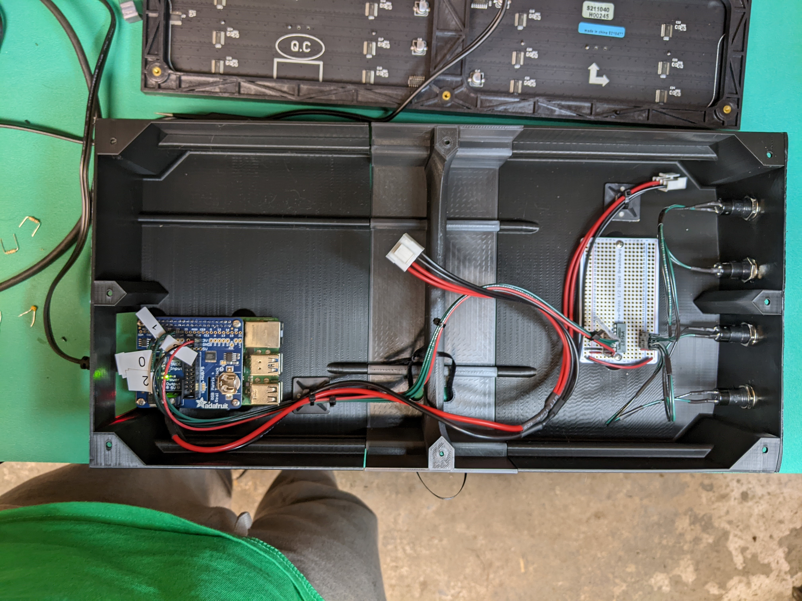

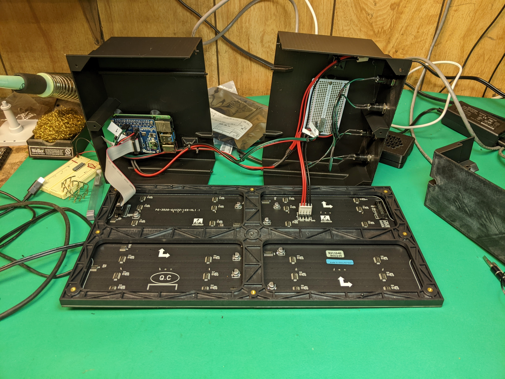

Use M3 screws to secure the backshell.  The alignment pins will only loosely fit - they won't grip each other.  The screws are required to keep things from sliding around.

